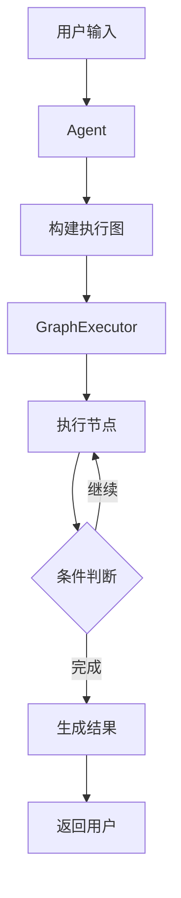

# ZZZero Agent 架构设计

## 整体架构

ZZZero Agent 是一个基于节点编排的 AI Agent 框架，采用了模块化设计，支持多种 Agent 范式和工具集成。

## 核心设计原则

1. **模块化**：各个组件独立且可替换
2. **可扩展**：易于添加新的节点、Agent、解析器等
3. **类型安全**：使用 Pydantic 进行类型验证
4. **异步优先**：所有 I/O 操作都是异步的
5. **最佳实践**：遵循 SOLID 原则和设计模式

## 核心组件

### 1. 基础层 (core)

#### Base Classes
- `BaseNode`: 所有节点的基类，定义了节点的生命周期
- `BaseAgent`: 所有 Agent 的基类，定义了 Agent 接口
- `BaseExecutor`: 执行器基类，负责执行图
- `BaseParser`: 解析器基类，负责解析 LLM 输出
- `BaseLLM`: LLM 接口，统一不同 LLM 提供商
- `BaseTool`: 工具基类，定义工具接口

#### Graph Engine
- `Graph`: 执行图的数据结构
- `GraphBuilder`: 流式 API 构建图
- `GraphExecutor`: 执行图的引擎
- `NodeConnection`: 节点连接定义

#### Type System
- 使用 Pydantic 定义所有数据模型
- 提供完整的类型提示
- 运行时类型验证

### 2. 节点层 (nodes)

预定义的节点实现：
- `ThinkNode`: 思考和推理
- `ActNode`: 选择和执行工具
- `ObserveNode`: 分析执行结果
- `RouterNode`: 路由决策
- `ParallelNode`: 并行执行
- `FinalizeNode`: 生成最终答案

### 3. Agent 层 (agents)

不同范式的 Agent 实现：
- `ReactAgent`: ReAct (Reasoning + Acting) 范式
- `ChainOfThoughtAgent`: 思维链范式
- `PlanExecuteAgent`: 计划-执行范式

### 4. LLM 层 (llm)

统一的 LLM 接口和实现：
- `LLMFactory`: 工厂模式创建 LLM 实例
- `DoubaoLLM`: 豆包 AI 实现
- `OpenAILLM`: OpenAI 实现
- 支持流式输出和重试机制

### 5. 解析器层 (parsers)

解析 LLM 输出：
- `JSONParser`: 智能 JSON 解析
- `ToolCallParser`: 工具调用解析
- `StructuredOutputParser`: 结构化输出（Pydantic）
- `RegexParser`: 正则表达式解析

### 6. 工具层 (tools)

工具管理和集成：
- `ToolManager`: 工具管理器
- `MCPToolManager`: MCP 协议工具集成
- 支持动态注册和启用/禁用

### 7. Web 层 (web)

Gradio 界面：
- ChatGPT 风格的聊天界面
- 配置面板（LLM、Agent、工具）
- 批量任务处理
- 执行轨迹可视化

## 执行流程



## 设计模式

1. **工厂模式**
   - `LLMFactory`: 创建不同的 LLM 实例
   - 易于扩展新的 LLM 提供商

2. **策略模式**
   - 不同的 Agent 实现不同的策略
   - 不同的 Parser 实现不同的解析策略

3. **模板方法模式**
   - `BaseNode.run()`: 定义了节点执行的模板
   - 子类实现 `execute()` 方法

4. **建造者模式**
   - `GraphBuilder`: 流式 API 构建复杂的图结构

5. **观察者模式**
   - 执行轨迹记录
   - 节点状态变化通知

## 扩展指南

### 添加新节点

```python
from src.core.base import BaseNode
from src.core.types import NodeInput, NodeOutput, NodeType

class CustomNode(BaseNode):
    def __init__(self, name: str):
        super().__init__(name, NodeType.CUSTOM)
        
    async def execute(self, input_data: NodeInput) -> NodeOutput:
        # 实现你的逻辑
        return NodeOutput(...)
```

### 添加新 Agent

```python
from src.core.base import BaseAgent
from src.core.graph import GraphBuilder

class CustomAgent(BaseAgent):
    def build_graph(self) -> Graph:
        # 构建你的执行图
        pass
        
    async def run(self, query: str) -> TaskResult:
        # 实现执行逻辑
        pass
```

### 添加新 LLM

```python
from src.llm.base import BaseLLMProvider, LLMFactory

class CustomLLM(BaseLLMProvider):
    async def generate(self, messages) -> Message:
        # 实现生成逻辑
        pass

# 注册到工厂
LLMFactory.register("custom", CustomLLM)
```

## 性能考虑

1. **异步执行**：所有 I/O 密集操作都是异步的
2. **并行处理**：支持并行执行节点和批量任务
3. **连接池**：HTTP 客户端使用连接池
4. **缓存**：可以添加结果缓存层

## 安全考虑

1. **输入验证**：使用 Pydantic 进行输入验证
2. **API 密钥管理**：使用环境变量管理敏感信息
3. **工具权限**：可以控制工具的启用/禁用
4. **错误处理**：完善的错误处理和日志记录

## 未来改进

1. **更多 Agent 范式**：Tree of Thought、Reflexion 等
2. **更多 LLM 支持**：Gemini、Claude 等
3. **持久化**：执行轨迹和结果的持久化存储
4. **监控**：添加 Prometheus 指标
5. **插件系统**：支持第三方插件 