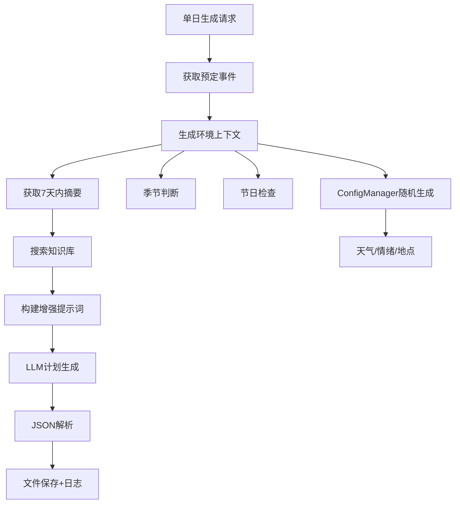

# 角色扮演工具最终增强总结

## 🔧 修复的关键问题

### 1. KeyError: 'generated_at' 错误
**问题**：在失败情况下，`_add_to_history`方法期望的字段不存在
**解决方案**：使用`.get()`方法安全获取字段，并提供备用字段

```python
"generated_at": result.get("generated_at") or result.get("completed_at") or result.get("failed_at") or datetime.now().isoformat()
```

### 2. 昨日活动摘要逻辑修正
**原有问题**：只获取最近3天摘要
**修正后**：累计7天内的活动摘要，与周摘要逻辑保持一致

```python
# 获取最近7天的摘要（包括昨天在内最多7天）
start_index = max(0, day_index - 7)
```

### 3. 计划性质强调
**问题**：生成的内容容易被理解为已发生的事情
**解决方案**：
- 修改提示词强调"计划制定"而非"活动生成"
- 在事件描述中添加"计划"、"准备"、"打算"等未来时态
- 明确指出这是未来的安排

## 🚀 新增环境信息功能

### 1. 环境上下文生成器
新增 `_generate_environmental_context()` 方法，自动生成：

```python
{
    "season": "春季",           # 基于月份自动判断
    "holiday": "元旦节",        # 内置节日判断
    "weather": "阳光明媚",      # 配置管理器随机生成
    "emotion": "充满活力",      # 建议的情绪氛围
    "location_work": "实验室",  # 工作地点推荐
    "location_home": "书房",    # 居家地点推荐 
    "location_leisure": "公园", # 休闲地点推荐
    "date_info": "2024年01月01日 冬季"
}
```

### 2. 集成到提示词系统
在日程生成提示词中自动添加环境信息块：

```
【环境信息】
- 日期时节: 2024年01月01日 冬季
- 季节: 冬季
- 天气: 阳光明媚
- 节日: 元旦节
- 建议情绪氛围: 充满活力
- 推荐地点参考: 
  * 工作: 实验室
  * 居家: 书房
  * 休闲: 公园
```

### 3. 配置管理器完整利用
利用已有的ConfigManager提供丰富的：
- **地点选择**：居住、工作、休闲、社交、户外等场所
- **天气生成**：晴朗、阴天、雨天、特殊天气
- **情绪氛围**：积极、中性、挑战等情绪

## 📋 更新的提示词系统

### 1. 主要变化
- **标题**：从"生成今天的详细5阶段日程安排" → "制定今天的详细5阶段日程计划"
- **字段名**：从"今日预定活动" → "今日预定计划"
- **参考性质**：明确"昨日活动摘要（过往参考）"
- **时间范围**：明确"近期背景信息（7天内摘要）"

### 2. 计划制定要求（新增第9条）
```
9. **体现未来性**：使用"计划"、"准备"、"打算"等未来时态的表达
```

### 3. 事件格式化改进
```python
# 原来
f"- {event['activity_name']} ({event['activity_type']})"

# 现在
f"- 计划{event['activity_type']}: {event['activity_name']} （计划开始）"
```

## 🎯 预期效果

### 1. 更真实的环境体验
- 根据季节安排不同活动（冬季室内、夏季避暑等）
- 考虑天气因素（雨天室内、晴天户外等）
- 结合节日制定特殊计划
- 情绪氛围指导活动选择

### 2. 更清晰的计划性质
- 用户明确这是未来计划，不是历史记录
- 增强计划的可执行性和指导意义
- 体现角色的前瞻性和规划能力

### 3. 更丰富的背景信息
- 7天滚动摘要提供完整的近期背景
- 环境信息丰富计划细节
- 知识库支持专业性内容

## 🔍 示例对比

### Before（修复前）
```json
{
  "morning": [{
    "activity_name": "天文研究",
    "details": "进行天文观测数据分析"
  }]
}
```

### After（修复后）
```json
{
  "morning": [{
    "activity_name": "天文研究计划",
    "details": "计划在书房中进行天文观测数据分析，考虑到今日阳光明媚的天气，准备在上午的自然光线下仔细核对观测记录，为下午的实验室工作做好准备"
  }]
}
```

## 📊 技术架构改进



## 🎉 完成功能列表

- ✅ 修复JSON序列化错误
- ✅ 修复KeyError崩溃问题 
- ✅ 改进昨日摘要为7天累计
- ✅ 强化计划未来性表达
- ✅ 集成天气、地点、季节、节日
- ✅ 利用ConfigManager情绪因素
- ✅ 完整的环境上下文生成
- ✅ LLM结果打印和文件地址返回
- ✅ 工具参数简化为无参数调用

现在系统能够生成更加真实、丰富、具有计划性的365天详细日程！🎯 