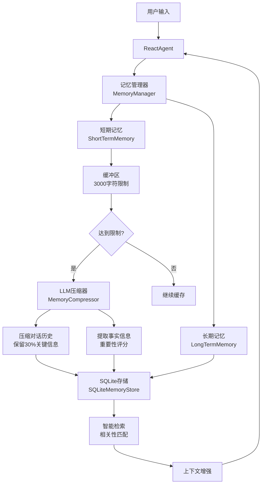

# ZZZero 记忆系统文档

## 概述

ZZZero AI Agent框架集成了先进的记忆管理系统，为Agent提供了短期记忆缓冲、自动压缩、长期存储和智能检索等功能。

## 架构设计



## 核心特性

### 1. 分层记忆架构
- **短期记忆**: 3000字符缓冲区，存储最近对话
- **长期记忆**: 持久化存储，支持压缩记忆、事实记忆和对话记忆

### 2. 自动压缩机制
- 当短期记忆达到限制时，自动使用LLM进行压缩
- 保留约30%的关键信息，去除冗余内容
- 同时提取重要事实信息单独存储

### 3. 智能检索
- 根据查询内容检索相关记忆片段
- 支持文本相似度匹配
- 自动注入相关上下文到系统提示中

### 4. 会话隔离
- 每个会话拥有独立的记忆空间
- 支持多用户并发使用

## 使用方法

### 1. 基本配置

```python
from src.core.memory import MemoryManager, SQLiteMemoryStore
from src.llm.base import LLMFactory
from src.core.types import LLMConfig

# 创建LLM配置
llm_config = LLMConfig(
    provider="doubao",
    model_name="your-model",
    temperature=0.7
)

# 创建LLM实例
llm = LLMFactory.create(llm_config)
await llm.initialize()

# 创建记忆存储
memory_store = SQLiteMemoryStore("./workspace/memory.db")

# 创建记忆管理器
memory_manager = MemoryManager(
    llm=llm,
    store=memory_store,
    short_term_limit=3000,  # 短期记忆限制
    session_id="user_session_001"
)
```

### 2. 在Agent中使用

```python
from src.agents.react_agent import ReactAgent

# 创建带记忆的Agent
agent = ReactAgent(
    llm=llm,
    tool_manager=tool_manager,
    memory_enabled=True,  # 启用记忆
    session_id="user_session_001",
    short_term_limit=3000
)

# 运行对话
result = await agent.run("你好，我是张三")
# 记忆会自动保存用户消息和Agent回复
```

### 3. 手动记忆操作

```python
# 添加对话到记忆
await memory_manager.add_conversation(
    user_message="我想学习Python",
    agent_response="Python是一门很棒的语言！"
)

# 获取相关上下文
context = await memory_manager.get_context_for_query("Python学习")

# 获取记忆统计
stats = await memory_manager.get_stats()

# 清空记忆
await memory_manager.clear_all()

# 导出记忆数据
export_data = await memory_manager.export_data()
```

## 前端界面

### 记忆管理面板
Web界面提供了完整的记忆管理功能：

1. **实时状态显示**
   - 短期记忆使用情况
   - 长期记忆统计信息
   - 压缩次数和效果

2. **手动操作**
   - 刷新记忆状态
   - 清空当前会话记忆
   - 导出记忆数据

3. **自动集成**
   - 对话自动保存到记忆
   - 相关记忆自动注入上下文
   - 压缩过程透明进行

## 配置选项

### MemoryManager 参数

| 参数 | 类型 | 默认值 | 说明 |
|------|------|--------|------|
| `llm` | BaseLLMProvider | 必需 | LLM实例，用于压缩 |
| `store` | BaseMemoryStore | 必需 | 记忆存储实例 |
| `short_term_limit` | int | 3000 | 短期记忆字符限制 |
| `session_id` | str | 自动生成 | 会话ID |

### ReactAgent 记忆参数

| 参数 | 类型 | 默认值 | 说明 |
|------|------|--------|------|
| `memory_enabled` | bool | True | 是否启用记忆 |
| `memory_store` | SQLiteMemoryStore | None | 自定义存储 |
| `short_term_limit` | int | 3000 | 短期记忆限制 |
| `session_id` | str | None | 会话ID |

## 记忆类型

### 1. 对话记忆 (conversation)
- 存储用户和Agent的对话内容
- 重要性评分: 0.5
- 格式: "用户: [消息]\n助手: [回复]"

### 2. 压缩记忆 (compressed)
- LLM压缩的对话摘要
- 重要性评分: 0.8
- 保留关键信息，去除冗余

### 3. 事实记忆 (fact)
- 从对话中提取的重要事实
- 重要性评分: 0.7
- 具体、可验证的信息

## 性能优化

### 1. 数据库优化
- 使用SQLite索引加速查询
- 支持会话ID、时间戳、重要性索引

### 2. 内存管理
- 短期记忆使用内存缓冲
- 长期记忆异步写入数据库
- 自动清理过期数据

### 3. 压缩策略
- 只在必要时触发压缩
- 批量处理多个对话
- 保留最重要的30%信息

## 扩展开发

### 自定义存储后端

```python
from src.core.memory import BaseMemoryStore

class CustomMemoryStore(BaseMemoryStore):
    async def save(self, entry: MemoryEntry) -> bool:
        # 实现自定义存储逻辑
        pass
    
    async def search(self, query: str, session_id: str, limit: int = 10) -> List[MemoryEntry]:
        # 实现自定义搜索逻辑
        pass
```

### 自定义压缩器

```python
from src.core.memory import MemoryCompressor

class CustomCompressor(MemoryCompressor):
    async def compress_conversations(self, conversations: List[str], target_ratio: float = 0.3):
        # 实现自定义压缩逻辑
        pass
```

## 故障排除

### 常见问题

1. **记忆不保存**
   - 检查数据库文件权限
   - 确认LLM初始化成功
   - 查看错误日志

2. **压缩不触发**
   - 检查短期记忆限制设置
   - 确认对话长度足够
   - 验证LLM可用性

3. **检索无结果**
   - 检查会话ID匹配
   - 确认记忆已保存
   - 尝试不同查询词

### 调试模式

```python
import logging
logging.getLogger('src.core.memory').setLevel(logging.DEBUG)
```

## 最佳实践

1. **合理设置限制**: 根据使用场景调整短期记忆限制
2. **定期备份**: 导出重要的记忆数据
3. **监控性能**: 关注记忆统计信息
4. **会话管理**: 为不同用户使用不同会话ID
5. **清理策略**: 定期清理不需要的记忆数据

## 示例代码

完整的使用示例请参考 `test_memory.py` 文件。 