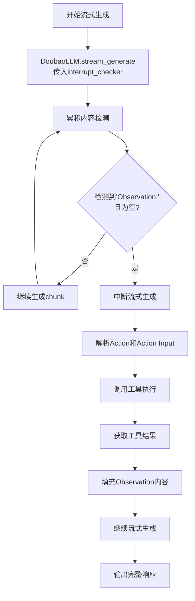

# 流式ReAct Agent节点改进总结

## 改进内容

### 1. 简化中断检测逻辑
- **移除复杂的中断检查分支**：不再需要检查LLM是否支持`stream_generate_with_interrupt`方法
- **统一使用doubao llm的中断机制**：直接调用`llm.stream_generate(messages, interrupt_checker=should_interrupt_for_observation)`
- **优化检测条件**：将"Observation:"结尾检测提前，提高检测准确性

### 2. 改进的检测逻辑
```python
def _should_trigger_tool_execution(self, text: str) -> bool:
    """判断是否应该触发工具执行 - 检测空的Observation"""
    import re
    
    # 检查是否有Action和Action Input
    has_action = "Action:" in text
    has_action_input = "Action Input:" in text
    has_observation = "Observation:" in text
    
    # 只有当所有必要元素都存在时才考虑触发
    if not (has_action and has_action_input and has_observation):
        return False
    
    # 特殊情况：检查是否以"Observation:"结尾（正在等待工具执行）
    if text.rstrip().endswith("Observation:"):
        return True
    
    # 查找所有Observation的位置和内容，检查是否有空的Observation
    # 使用修正后的正则表达式，只匹配同一行的内容
    observation_matches = list(re.finditer(r'Observation:([^\n]*?)(?=\n|$)', text))
    
    for observation_match in observation_matches:
        observation_content = observation_match.group(1).strip()
        
        # 如果找到空的Observation，则应该触发工具执行
        if not observation_content:
            return True
            
    return False
```

### 3. 核心工作流程



### 4. 测试结果
- ✅ 成功检测到空的"Observation:"并触发工具调用
- ✅ 正确执行了4次工具调用：
  1. `chromadb_list_collections` - 列出集合
  2. `chromadb_create_collection` - 创建集合  
  3. `chromadb_add_documents` - 添加文档
  4. `chromadb_query_documents` - 查询文档
- ✅ 流式输出正常，工具执行结果正确集成到响应中

### 5. 优势
1. **代码更简洁**：移除了复杂的分支逻辑
2. **检测更准确**：优化了Observation检测条件
3. **性能更好**：直接使用doubao llm的原生中断机制
4. **维护性更强**：统一的代码路径，更容易调试和维护

### 6. 关键改进点
- **提前检测**：将"Observation:"结尾检测提前到正则匹配之前
- **检查所有Observation**：不再只检查最后一个，而是检查所有Observation是否有空的
- **修正正则表达式**：使用`r'Observation:([^\n]*?)(?=\n|$)'`只匹配同一行内容，避免误匹配
- **简化逻辑**：只要发现空的Observation就触发工具执行，逻辑更清晰
- **统一接口**：所有LLM都使用相同的中断检测接口

## 使用方式

```python
# 创建流式ReAct Agent节点
agent_node = StreamReactAgentNode(
    name="stream_react_agent",
    llm=doubao_llm,  # 使用doubao llm
    tool_manager=tool_manager
)

# 执行节点
result = await agent_node.execute(input_data)

# 处理流式输出
for chunk in result.data["stream_chunks"]:
    if chunk["type"] == "text_chunk":
        print(chunk["content"], end="", flush=True)
    elif chunk["type"] == "tool_result":
        print(f"\n[工具执行: {chunk['tool_name']}]")
```

这次改进大大简化了代码复杂度，提高了检测准确性和系统稳定性。 