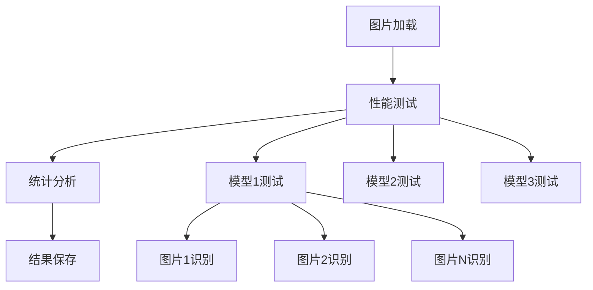

# 图片识别性能分析工具

## 功能概述

这个工具用于测试和比较多个豆包模型在图片识别任务上的性能，包括：

- ⏱️ **耗时统计**：记录每次识别的执行时间
- 🔢 **Token消耗**：统计输入、输出和总Token数量
- 📊 **多模型对比**：同时测试3种不同的豆包模型
- 📋 **详细报告**：生成CSV格式的详细结果和统计报告

## 测试的模型

1. **豆包Vision Pro** (`DOUBAO_MODEL_VISION_PRO`)
   - 默认模型：`ep-20250704095927-j6t2g`
   - 专门优化的视觉识别模型

2. **豆包DeepSeek R1** (`DOUBAO_MODEL_DEEPSEEKR1`)
   - 默认模型：`ep-20250221154107-c4qc7`
   - 推理能力强的通用模型

3. **豆包DeepSeek V3** (`DOUBAO_MODEL_DEEPSEEKV3`)
   - 默认模型：`ep-20250221154410-vh78x`
   - 高性能的语言理解模型

## 快速开始

### 1. 准备测试图片

将测试图片放在以下目录中：
```
workspace/input/对话日常图片/
├── 通用/          # 通用类图片
├── 动物修/        # 动物类图片
├── 美食修/        # 美食类图片
└── 风景修/        # 风景类图片
```

支持的图片格式：`.png`, `.jpg`, `.jpeg`

### 2. 设置环境变量

在 `.env` 文件或系统环境变量中设置：
```bash
ARK_API_KEY=your-api-key-here
DOUBAO_MODEL_VISION_PRO=your-vision-model-id
DOUBAO_MODEL_DEEPSEEKR1=your-deepseek-r1-model-id
DOUBAO_MODEL_DEEPSEEKV3=your-deepseek-v3-model-id
```

### 3. 运行测试

#### 方法一：使用批处理脚本（Windows）
```bash
start_vision_performance_test.bat
```

#### 方法二：直接运行Python脚本
```bash
python run_vision_performance_test.py
```

#### 方法三：直接运行工作流模块
```bash
python src/workflow/vision_performance_workflow.py
```

## 输出结果

测试完成后，将在 `workspace/vision_performance_output/` 目录下生成两个CSV文件：

### 1. 详细识别结果 (`vision_recognition_results_TIMESTAMP.csv`)

包含每次识别的详细信息：
- 模型名称和ID
- 图片名称和路径
- 识别生成的标题和描述
- 执行耗时（秒）
- Token消耗统计（输入/输出/总计）
- 时间戳和错误信息

### 2. 性能统计报告 (`vision_performance_stats_TIMESTAMP.csv`)

包含每个模型的性能统计：
- 测试图片总数、成功/失败数量、成功率
- 平均/中位数耗时和标准差
- 平均/中位数Token消耗和标准差
- 总计耗时和Token消耗

## 性能指标说明

### 时间统计
- **平均耗时**：所有成功识别的平均执行时间
- **中位耗时**：耗时的中位数，更能反映典型性能
- **耗时标准差**：反映性能稳定性，越小越稳定

### Token统计
- **输入Token**：发送给模型的Token数量（包括图片编码）
- **输出Token**：模型生成的回复Token数量
- **总Token**：输入+输出Token的总和（用于计算成本）

### 成功率
- **成功率**：成功识别的图片占总测试图片的百分比
- **错误信息**：记录失败时的具体错误

## 工作流架构



## 配置选项

可以在脚本中修改以下配置：

```python
config = {
    'batch_size': 10,  # 批处理大小
    'test_all_models': True,  # 是否测试所有模型
    'csv_output': {
        'enabled': True,
        'output_dir': 'workspace/vision_performance_output',
        'recognition_filename': 'vision_recognition_results.csv',
        'performance_filename': 'vision_performance_stats.csv',
        'encoding': 'utf-8-sig'  # 支持中文的编码
    }
}
```

## 故障排除

### 常见问题

1. **模型初始化失败**
   - 检查API密钥是否正确
   - 确认模型ID是否有效
   - 验证网络连接

2. **图片加载失败**
   - 确认图片文件存在且格式正确
   - 检查文件路径是否正确
   - 验证文件权限

3. **Token统计不准确**
   - 某些模型可能不返回详细的Token统计
   - 检查模型是否支持Token计数功能

### 日志查看

工作流会输出详细的执行日志，包括：
- 每个节点的执行状态
- 图片加载和识别进度
- 错误信息和警告

## 扩展功能

### 添加新模型

在 `VisionPerformanceWorkflow` 类的 `model_configs` 中添加新模型：

```python
self.model_configs = {
    # 现有模型...
    'new_model': {
        'name': '新模型名称',
        'env_key': 'NEW_MODEL_ENV_VAR',
        'default': 'default-model-id'
    }
}
```

### 自定义统计指标

在 `PerformanceStatisticsNode` 类中添加新的统计计算逻辑。

### 修改输出格式

在 `PerformanceResultSaveNode` 类中修改CSV字段和格式。

## 注意事项

1. **成本控制**：测试会消耗API调用次数和Token，请根据实际需要控制测试图片数量
2. **并发限制**：当前实现为串行测试，避免API限流
3. **文件大小**：大图片文件会增加传输时间和Token消耗
4. **模型差异**：不同模型对同一图片的识别结果可能差异较大

## 更新日志

- **v1.0.0**：初始版本，支持3种豆包模型的性能对比测试
- 支持详细的时间和Token统计
- 生成CSV格式的分析报告
- 提供流式执行和进度显示